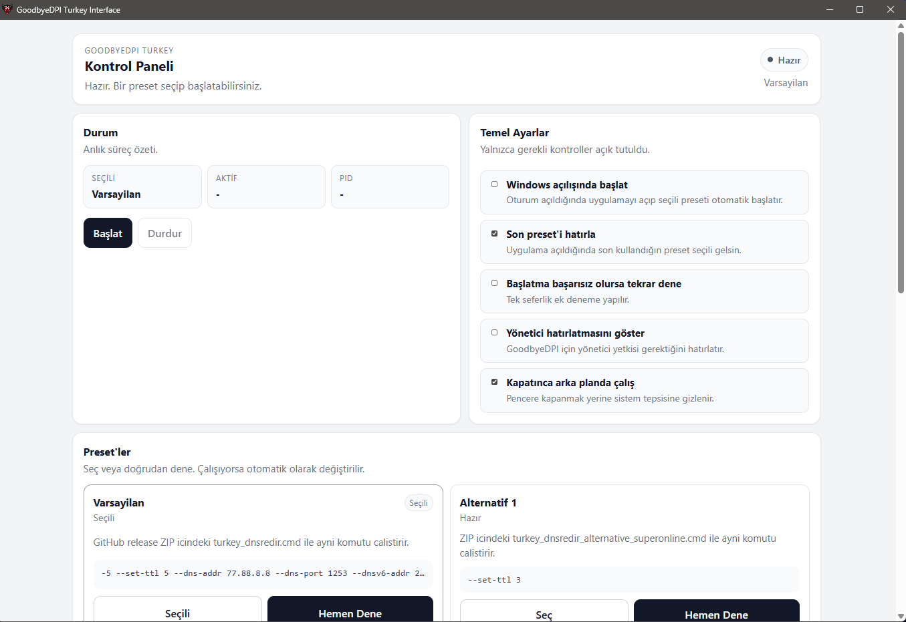
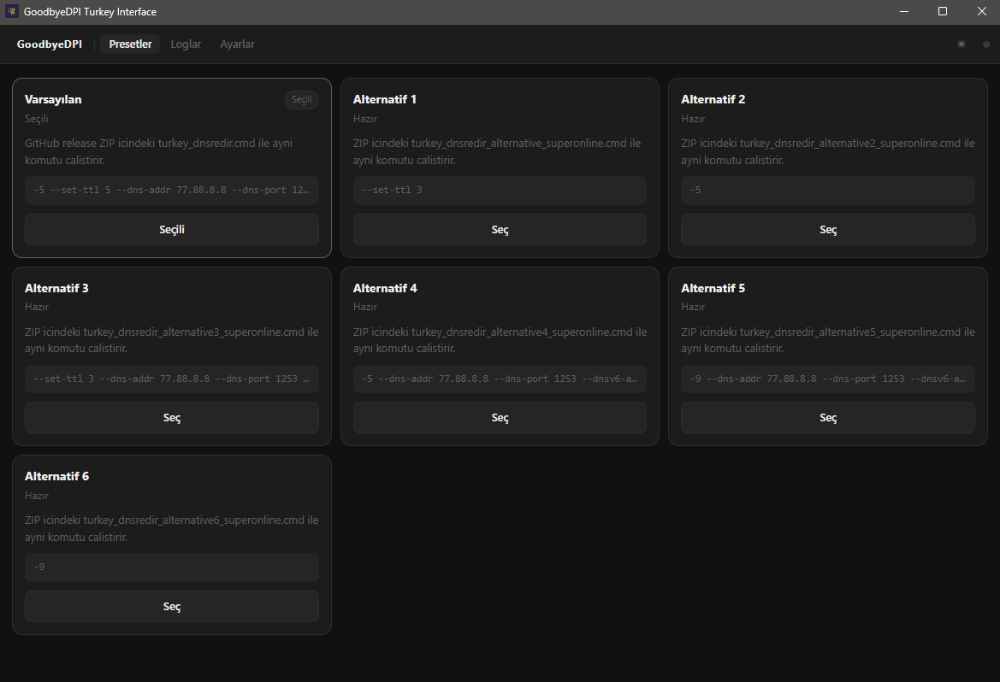
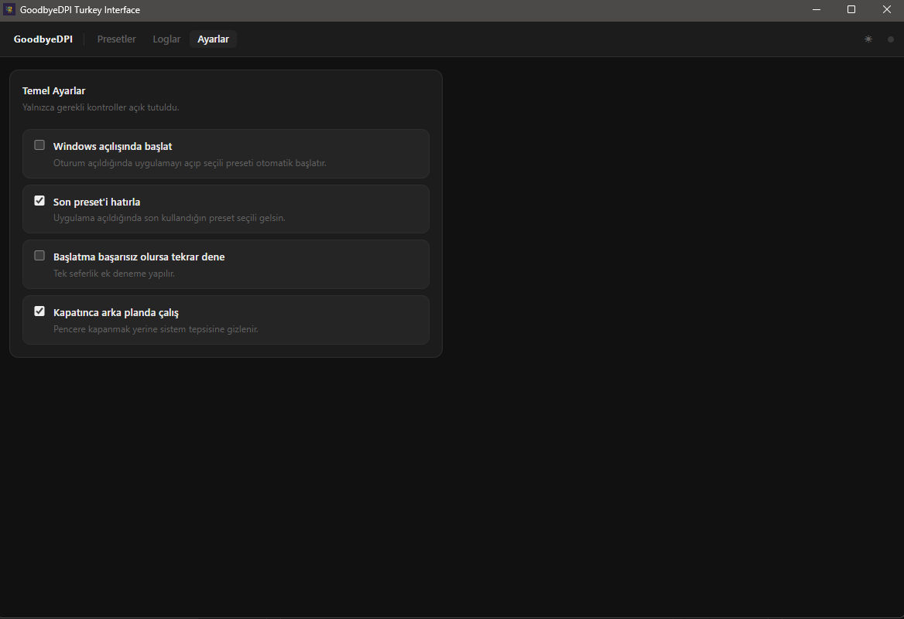

# GoodbyeDPI Turkey Interface

Bu proje, Discord ve diğer engelli site/uygulamalara VPN'siz ve internet hızında yavaşlama olmadan girmek için [cagritaskn/GoodbyeDPI-Turkey](https://github.com/cagritaskn/GoodbyeDPI-Turkey) projesinin **kullanıcı dostu masaüstü arayüzü (GUI)** versiyonudur.

## Ekran Görüntüleri





## Özet​

Windows için Tauri tabanlı bir kontrol panelidir. Komut satırı (CMD) pencereleri veya arka plan hizmetleriyle uğraşmak yerine, doğrudan kullanıcı dostu bir arayüz üzerinden tıkla-çalıştır mantığıyla çalışır.

## GoodbyeDPI | Derin Paket İnceleme (DPI) atlatma aracı (Türkiye versiyonu)

Bu uygulama, Türkiye'de bazı internet servis sağlayıcılarının DNS değişikliğine izin vermemesi sebebiyle, bu durumu bertaraf etmek için asıl proje olan [GoodbyeDPI](https://github.com/ValdikSS/GoodbyeDPI)'ın düzenlenmiş bir versiyonudur.
Bu yazılım, birçok ISS'da (İnternet Servis Sağlayıcısı) bulunan ve belirli web sitelerine erişimi engelleyen "Derin Paket İnceleme" (DPI) sistemlerini atlatmak için tasarlanmıştır.
Optik ayırıcı veya port yansıtma (Pasif DPI) kullanarak bağlanan ve herhangi bir veriyi engellemeyen, ancak istenen hedeften daha hızlı yanıt veren DPI'yi ve sıralı olarak bağlanan Aktif DPI'yi işler. Bu uygulama kesinlikle bir VPN değildir ve oyunlarda/genel internet kullanımında bir hız değişikliğine sebep olmayacaktır.

> [!NOTE]
> Windows 7, 8, 8.1, 10 veya 11 işletim sistemlerinde uygulamayı **yönetici olarak çalıştırmanız** mecburidir. Gerekli yetkiyi uygulama içerisinden veya kısayol üzerinden verebilirsiniz.

## Virüs & Antivirüs Uyarıları

Program ve içerisindeki `WinDivert.dll` / `WinDivert64.sys` dosyaları açık kaynak kodludur. Bazı antivirüs programları bu dosyaların paket inceleme/işleme özelliğinden dolayı **yanlış pozitif (false positive)** uyarı verebilir. Bu durum GoodbyeDPI'ın tüm sürümleri için yaygın ve beklenen bir davranıştır.

> [!IMPORTANT]
> WinDivert dosyalarının açıklamalarında bulunan Bitcoin adresi sizi korkutmasın. WinDivert, [basil00](https://github.com/basil00) isminde bir geliştiricinin ücretsiz kütüphanesidir. Adres, geliştiricinin bağış cüzdanıdır. Virüs veya mining işlemi yoktur.

### Neden Bu Uyarı Çıkıyor?

| Bileşen | Neden Uyarı Çıkıyor |
|---------|---------------------|
| `goodbyedpi.exe` + `WinDivert64.sys` | Kernel düzeyinde ağ trafiğini yakalar — bazı kötü amaçlı yazılımlar da aynı sürücüyü kullanır |
| NSIS `.exe` installer | İmzasız kurulum dosyası → SmartScreen'de sıfır itibar |
| Tauri binary (Rust) | Yeni, imzasız binary → makine öğrenmesi tabanlı heuristik |

### Kurulum Sırasında SmartScreen Engeli

Kurulumda **"Windows kişisel bilgisayarınızı korudu"** ekranı çıkıyorsa ve "Yine de çalıştır" butonu görünmüyorsa:

1. **Windows Güvenliği** → **Uygulama ve tarayıcı denetimi** → **İtibar tabanlı koruma ayarları** açın.
2. **Uygulamaları ve dosyaları denetle** (SmartScreen) seçeneğini kurulum bitene kadar kapatın.
3. Kurulumu tamamlayıp ardından SmartScreen'i tekrar açın.

### Windows Defender "Trojan" Tespiti

Defender kurulumdan sonra dosyaları karantinaya alıyorsa:

1. **Windows Güvenliği** → **Virüs ve tehdit koruması** → **Koruma geçmişi** açın.
2. Karantinaya alınan dosyayı bulun → **Geri Yükle** / **İzin Ver** seçin.
3. Aynı pencerede **Dışlama ekle** → kurulum klasörünü ekleyin  
   (varsayılan: `C:\Program Files\GoodbyeDPI Turkey Interface`)

> [!NOTE]
> Dosyaların yanlış tespit edildiğini Microsoft'a bildirmek isterseniz:  
> 👉 [Microsoft Security Intelligence — Dosya Gönder](https://www.microsoft.com/en-us/wdsi/filesubmission)  
> Microsoft dosyayı güvenli olarak onaylarsa bir sonraki Defender güncellemesinde tespit kaldırılır.

## Uygulamayı Kullanmak

1. GitHub `Releases` sayfasından en güncel Windows kurulum dosyasını indirin:
   - **NSIS:** `GoodbyeDPI.Turkey.Interface_<surum>_x64-setup.exe`
   - **MSI:** `GoodbyeDPI.Turkey.Interface_<surum>_x64_en-US.msi` (Defender uyarısı daha az)
2. Kurulum sırasında SmartScreen engeli çıkarsa yukarıdaki [SmartScreen adımlarını](#kurulum-sırasında-smartscreen-engeli) izleyin.
3. Kurulumu tamamladıktan sonra uygulamayı çalıştırın (Yönetici izni isteyecektir, onaylayın).
4. Arayüzden uygun **Preset** seçiminizi yapın (Örn: `turkey-dnsredir`).
5. **Başlat** butonuna tıklayarak DPI atlatma sürecini başlatın.

### Özellikler
- Preset odaklı başlat/durdur akışı (CMD gerektirmez)
- Anlık durum penceresi ve canlı stdout/stderr log takibi
- Sistem başlangıcında otomatik çalışma ve sistem tepsisine (Tray) küçülme
- Temel ayarların JSON olarak saklanması ve otomatik uygulanması

## Sık Karşılaşılan Sorunlar

- **Uygulama arka planda kapanmıyor / Dosya silinmiyor**: Uygulama kapanırken "Kapatınca arka planda çalış" ayarı aktifse sistem tepsisine gizlenir. Tamamen kapatmak için sistem tepsisindeki (sağ alt köşe) simgeye sağ tıklayıp "Çıkış" diyebilir veya arayüzden "Durdur" butonuna basarak DPI sürecini sonlandırabilirsiniz.
- **Discord açılmıyor ancak web çalışıyor**: Superonline ve Fiber kullanıcıları için bu durum yaşanabilir. Arayüzden `alternative2-superonline`, `alternative4-superonline` gibi diğer alternatif presetleri seçip test edebilirsiniz.
- **WinDivert bulunamadı veya Antivirüs siliyor**: Kurulum klasörünü antivirüs programınızda istisnalara (dışlamalara) ekleyin.


## Geliştirme Notları (Geliştiriciler İçin)

### Proje Yapısı
- `resources/goodbyedpi`: paketlenecek README, lisans ve Windows binary dosyaları
- `src`: React arayüzü
- `src-tauri`: Tauri/Rust backend'i
- `scripts/sync-upstream.mjs`: kaynakları resource klasörüne taşıyan yardımcı script

### Kurulum ve Çalıştırma
1. Bu makinede Node.js, `rust` ve `cargo` kurulu olmalı.
2. Windows için `resources/goodbyedpi/bin` altına `goodbyedpi.exe`, `WinDivert.dll` ve `WinDivert64.sys` dosyalarını yerleştirin.
3. Upstream dokümanlarını yenilemek isterseniz isteğe bağlı olarak `upstream/GoodbyeDPI-Turkey` altına kaynak repoyu clone edin.
4. Ardından:
```bash
npm install
npm run sync:upstream
npm run tauri dev
```

### Release Hazırlama
GitHub release varlıklarını otomatik yüklemek için `.github/workflows/release.yml` adında bir workflow hazırdır. Bu workflow Windows üzerinde projeyi build eder, NSIS `.exe` ve MSI `.msi` kurulum dosyalarını üretir ve GitHub Release'e otomatik yükler.

## Bağış ve Destek

Bu GUI projesi açık kaynak kodludur. Asıl DPI atlatma CLI aracı, kodları ve asıl geliştiriciye destek için [cagritaskn/GoodbyeDPI-Turkey](https://github.com/cagritaskn/GoodbyeDPI-Turkey) sayfasını ziyaret edebilirsiniz.

## Yasal Uyarı
> [!IMPORTANT]
> Bu uygulamanın kullanımından doğan her türlü yasal sorumluluk kullanan kişiye aittir. Uygulama yalnızca eğitim ve araştırma amaçları ile yazılmış ve düzenlenmiş olup; bu uygulamayı bu şartlar altında kullanmak veya kullanmamak kullanıcının kendi seçimidir.
